# Esercizio System Design : Interactive Map VR

Questo progetto nasce come proposta per un task tecnico-architetturale in ambito XR, finalizzato alla definizione di un sistema VR basato su Meta Quest 3.  
L'obiettivo è progettare un'applicazione in grado di rappresentare mappe tridimensionali locali sulle quali vengono applicati metadati vettoriali, come punti e linee, corrispondenti a elementi territoriali o ambientali.  
Il sistema deve offrire un'esperienza collaborativa condivisa tra più utenti presenti nello stesso spazio fisico, mantenendo la coerenza spaziale tra i diversi visori.

Le principali caratteristiche previste includono:
- Visualizzazione in 3D del territorio e dei metadati associati
- Sincronizzazione in tempo reale della scena tra 2 o 3 visori Meta Quest 3
- Allineamento spaziale preciso degli oggetti nel mondo reale tramite ancore condivise
- Possibilità di manipolare alcuni oggetti o metadati direttamente durante la sessione
- Salvataggio e ripristino dello stato della scena per sessioni successive

Durante la progettazione si è ipotizzato uno scenario tipico in cui un piccolo gruppo di operatori, lavora in co-presenza per analizzare e annotare dati territoriali. L'applicazione deve quindi garantire bassa latenza, coerenza visiva tra utenti e capacità di persistere le modifiche in modo sicuro.

Il documento che segue costituisce una sintesi architetturale dell'intero esercizio: descrive il processo di analisi delle alternative tecniche considerate, le scelte adottate e i criteri che ne hanno guidato la selezione. 

Sono state valutate più configurazioni di rete e distribuzione dei ruoli, confrontandone complessità, costi operativi e affidabilità.  
Tra le opzioni esaminate sono state identificate due soluzioni ritenute tecnicamente valide:
1. Shared Mode: punta a ridurre l'infrastruttura centralizzata e garantisce un buon equilibrio tra resilienza e semplicità operativa.
2. Server-Host Mode: più indicata per ambienti regolamentati, dove si richiede controllo centralizzato, tracciabilità e isolamento dei componenti.

Entrambe le soluzioni vengono descritte nel dettaglio nelle sezioni successive, con un'analisi dei loro trade-off e delle implicazioni architetturali principali.

---

## Scenario applicativo

Lo scenario che segue rappresenta un caso d'uso ipotetico, costruito per supportare le decisioni di progettazione architetturale.  
Non descrive un requisito formale, ma un insieme di assunzioni ragionevoli che aiutano a valutare le diverse alternative tecniche.  
In un progetto reale, questi aspetti verrebbero discussi e validati con il committente.  
L'obiettivo è immaginare un flusso d'utilizzo coerente, su cui fondare la scelta dell'architettura più adatta.

L'applicazione è pensata come un sistema collaborativo, accessibile tramite login iniziale.  
Una volta autenticato, l'utente può decidere come entrare in sessione:
- **Create Room**: per creare una nuova stanza o riaprire una sessione salvata.  
- **Join Room**: per unirsi a una stanza esistente, inserendo un codice d'invito.  

Nel caso di creazione, l'utente può:
- Avviare una nuova sessione vuota;  
- Oppure selezionare uno salvataggio precedente, per ripristinare lo stato dei metadati.

Durante l'inizializzazione della stanza:
- Viene richiesto di posizionare un anchor nello spazio fisico;  
- L'anchor viene condiviso automaticamente con gli altri utenti della stanza, garantendo la coerenza spaziale tra i visori;  
- L'applicazione genera un invitation code numerico e breve, facilmente comunicabile a voce ai presenti nella stessa stanza.

Gli utenti che scelgono **Join Room**:
- Inseriscono il codice d'invito ricevuto;  
- Si connettono alla stessa stanza Photon;  
- Ricevono immediatamente lo stato sincronizzato della scena.

All'interno della stanza:
- Viene mostrato un modello 3D dell'area di interesse;  
- Sopra di esso vengono proiettati **metadati vettoriali** (punti, linee, poligoni);  
- I partecipanti possono **manipolare gli oggetti** in tempo reale, visualizzando gli aggiornamenti in modo sincronizzato.  

Il sistema prevede:
- Fino a tre salvataggi manulai per Room gestiti dal backend;  
- Un autosave periodico ogni 2–3 minuti, per prevenire la perdita di dati;  
- La possibilità di ripristinare qualsiasi versione precedente della sessione.  

---

## Photon Shared Mode

### System Context Diagram
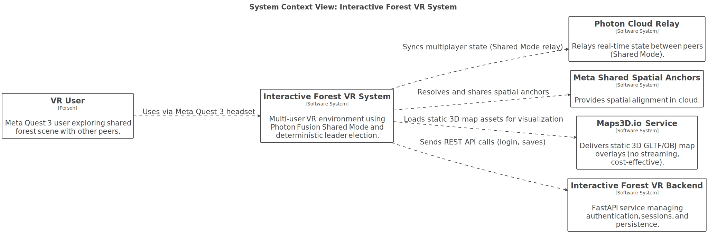

### Container Diagram
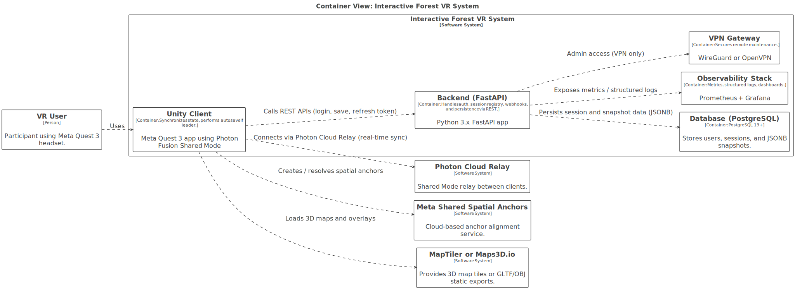

### Descrizione
In questa soluzione si è scelto di utilizzare **Photon Fusion** come strumento principale per la gestione della sincronizzazione e dello scambio dati tra i visori.  
Photon Fusion consente di creare sessioni condivise (room) in cui più utenti possono interagire in tempo reale all'interno dello stesso spazio virtuale.  Tra le diverse modalità offerte, è stata selezionata la **Shared Mode**, che rappresenta un buon compromesso tra semplicità e affidabilità.

La scelta di Shared Mode è motivata dal fatto che:
- garantisce una maggiore resilienza rispetto alle architetture basate su host unici: se un utente si disconnette, la sessione resta attiva per gli altri partecipanti
- mantiene prestazioni adeguate ai requisiti del progetto (latenza inferiore a 100 ms) grazie all'uso della rete locale
- non comporta costi aggiuntivi di licenza Photon, sfruttando l'infrastruttura cloud inclusa nel piano base    

Ogni visore Meta Quest 3 partecipa come peer, connesso al relay Photon Cloud.  
Il sistema prevede un meccanismo di elezione deterministica del leader, basato sul valore più basso di `ActorNumber` o, in alternativa, sull'identificativo utente minimo.  

Solo il leader corrente può inviare operazioni di salvataggio automatico verso il backend; se il leader cambia durante la sessione, il backend risponde con `409 leader_changed`, permettendo ai peer di ricalcolare la leadership.

Oltre al layer di networking, l'architettura include un backend dedicato con più funzioni:
- gestione dei segreti che non devono risiedere sui client (ad esempio, le chiavi o gli AppID di Photon)
- autenticazione e tracciamento degli utenti, utile per assegnare la proprietà dei metadati modificabili
- persistenza dei dati di sessione e dei salvataggi, con struttura coerente al modello a snapshot

Il backend è stato progettato per essere interamente containerizzato.  La struttura e l'organizzazione delle API del backend sono documentate in dettaglio nella [specifica OpenAPI](assets/open-api/v3.html), consultabile in formato navigabile.
L'intero sistema (FastAPI, PostgreSQL, Prometheus, Grafana, e servizi accessori) è orchestrato tramite Docker Compose, soluzione che offre due vantaggi strategici:
1. può essere distribuito on-prem, mantenendo la persistenza dei dati e le metriche a latenza minima
2. può essere facilmente spostato su un cloud provider, trasferendo eventuali costi operativi al cliente senza modifiche strutturali

Il backend espone un set limitato di responsabilità: gestisce autenticazione, persistenza e validazione delle richieste, lasciando la logica runtime interamente a Photon.  
In questo modo i client rimangono leggeri e stateless, mentre la parte sensibile (segreti e stato persistente) resta centralizzata e controllata.

Per la componente geografica, sono proposte due opzioni:
- **Maps3D.io** per l'esportazione di aree in formato glTF, che consente caching locale e caricamento rapido, riducendo i tempi di setup
- **MapTiler On-Prem** come soluzione alternativa in contesti enterprise, per la gestione di tile 3D e texture a livelli di dettaglio variabile (LOD), con licenza self-hosted

La persistenza spaziale degli oggetti condivisi è gestita tramite Meta Shared Spatial Anchors.  
Questa tecnologia, nativa dei dispositivi Meta Quest, permette di mantenere la coerenza spaziale tra visori senza richiedere componenti aggiuntivi lato server.  È gratuita, stabile e perfettamente integrata con l'SDK Meta XR, riducendo tempi di sviluppo e complessità di manutenzione.

Infine, nell'architettura è stato previsto un VPN Gateway (WireGuard / OpenVPN) utile per operazioni di manutenzione remota nei casi di installazioni completamente on-prem.  
Il tunnel consente aggiornamenti software e verifiche diagnostiche solo su richiesta del cliente, evitando interventi fisici in sede e mantenendo l'isolamento operativo dell'ambiente di produzione.

### Flussi di interazione e API

Questa sezione illustra i principali flussi operativi del sistema.  
Ogni diagramma rappresenta uno scenario tipico di interazione tra i componenti principali (client, Photon, backend e database), accompagnato da una breve descrizione testuale.

#### Creazione Stanza  
Questo flusso descrive la fase iniziale in cui un utente autenticato crea una nuova stanza su Photon.  
Il client effettua il login, richiede la creazione della sessione al backend, e successivamente il backend registra le informazioni nel database in seguito alla notifica `game-created` inviata da Photon.

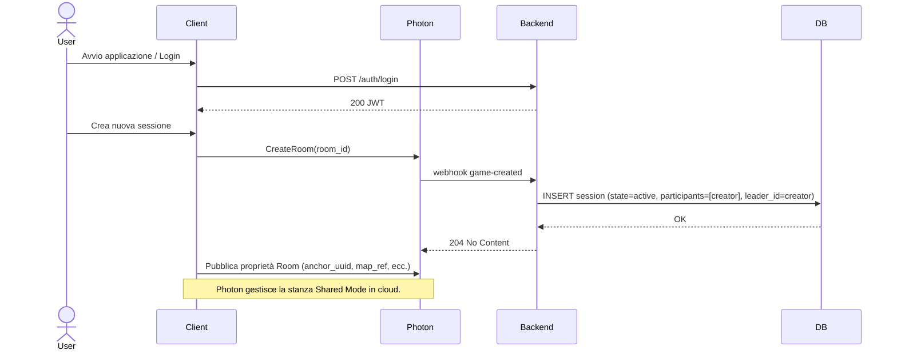
#### Join Stanza  
Un utente inserisce il codice stanza per unirsi a una sessione esistente.  
Photon notifica il backend tramite il webhook `player-joined`, che aggiorna la lista dei partecipanti e ricalcola l'identificativo del leader corrente.

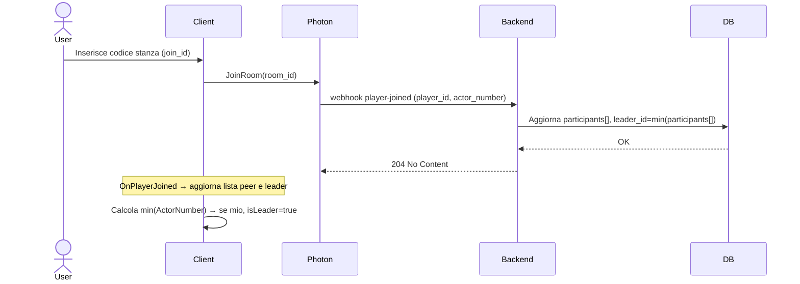

#### Cambio Leader  
Quando un utente lascia la sessione, il backend riceve il webhook `player-left` e ricalcola il nuovo leader basandosi sul peer con `ActorNumber` più basso.  
I client aggiornano automaticamente il loro stato locale di leadership.

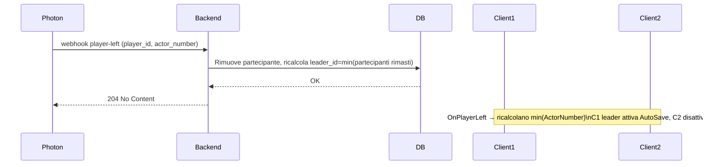

#### Autosave Periodico  
Il peer leader effettua periodicamente un salvataggio automatico (`autosave`) inviando lo snapshot al backend.  
Il backend valida la leadership e registra lo stato nel database; se la leadership è cambiata, restituisce `409 leader_changed`.

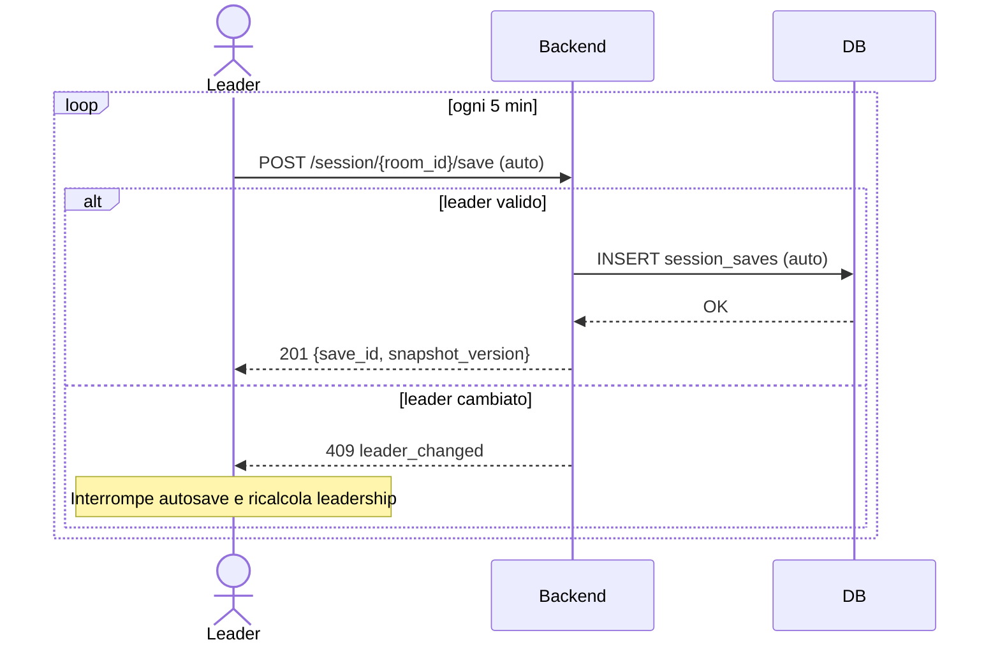

#### Salvataggio Manuale  
L'utente leader può avviare un salvataggio manuale in uno degli slot disponibili.  
Il backend controlla l'autorizzazione e persiste i dati della sessione.

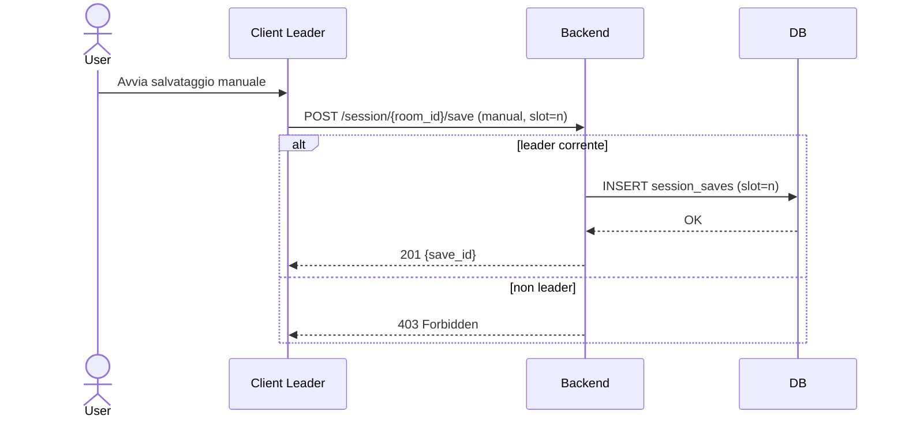

#### Chiusura Sessione  
Alla chiusura della stanza, Photon invia il webhook `game-closed`.  
Il backend aggiorna lo stato della sessione nel database e registra un salvataggio finale automatico.

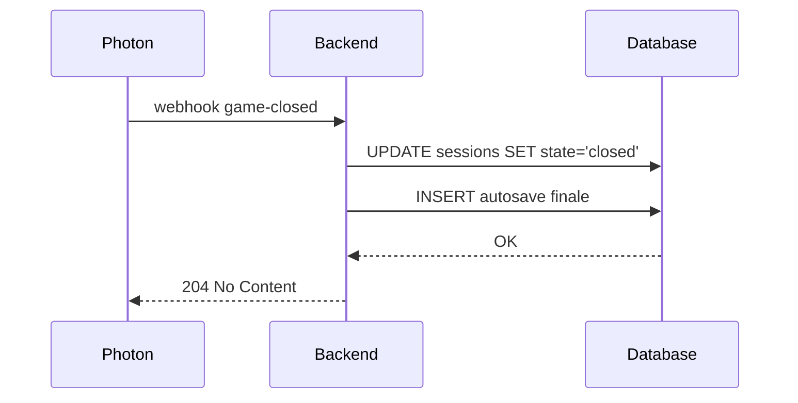

#### Visualizzazione Partecipanti  
Il client può richiedere al backend la lista aggiornata dei partecipanti e l'identificativo del leader corrente per la stanza attiva.

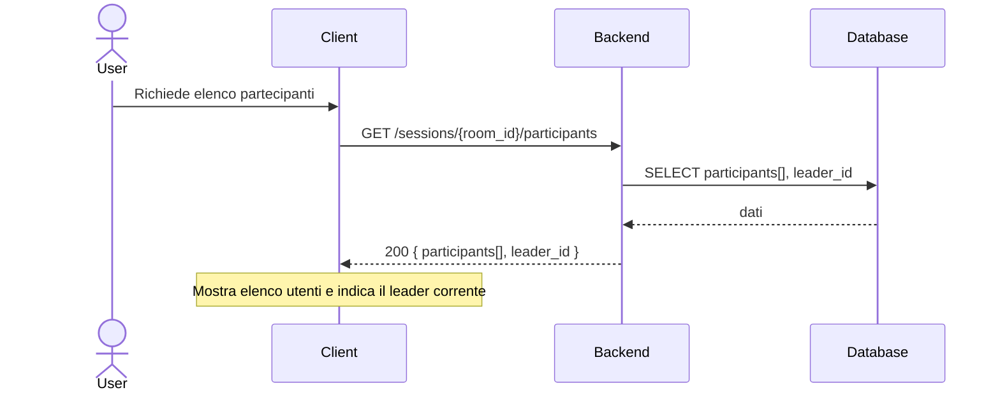

#### Webhooks Photon → Backend  
Questo flusso riassume la sequenza completa di webhook generati da Photon (creazione, join, left, chiusura) e come il backend aggiorna di conseguenza lo stato persistente.

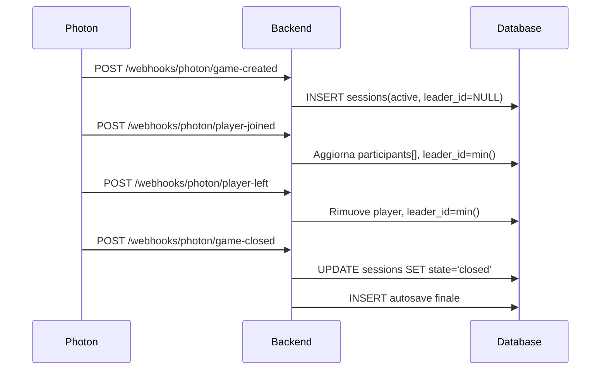

#### Flusso di Errore – Leader Cambiato  
In caso di mismatch tra il leader identificato dal backend e quello che tenta il salvataggio, viene restituito l'errore `409 leader_changed`, consentendo ai client di riallineare la leadership.

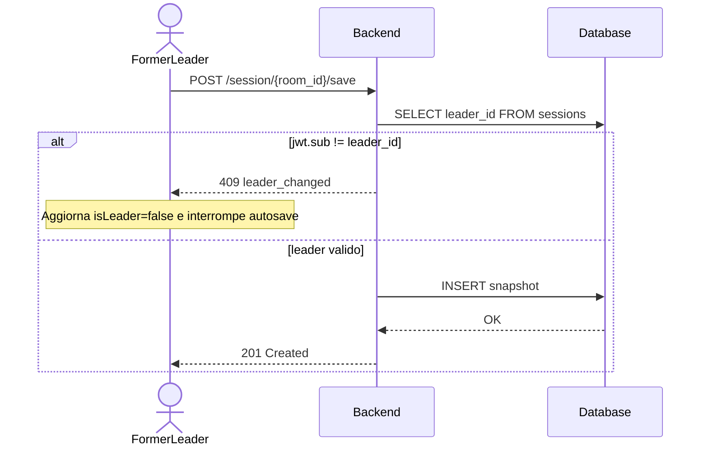

---

## Photon Server Mode
### System Context Diagram

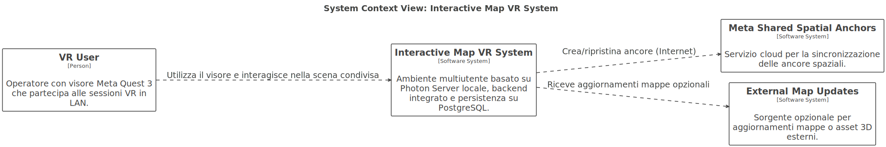

### Container Diagram
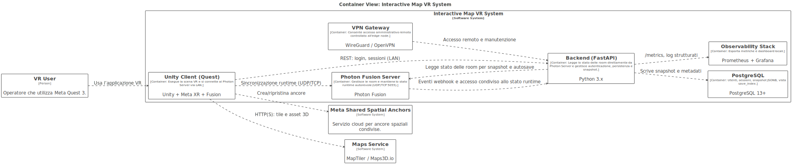

### Descrizione
Questa architettura rappresenta l'alternativa alla precedente soluzione in Shared Mode.  
In questo caso viene adottata la modalità Photon Fusion Server Mode, configurata in ambiente on-premise per mantenere l'intera simulazione e la persistenza dei dati all'interno della rete locale del cliente.

Con Server Mode, il ruolo di autorità runtime viene spostato da uno dei visori a un server dedicato, eliminando così la dipendenza da un peer leader.  La struttura e l'organizzazione delle API del backend sono documentate in dettaglio nella [specifica OpenAPI](assets/open-api/v2.html), consultabile in formato navigabile.

L'edge server esegue Photon, il backend FastAPI, il database PostgreSQL, i servizi di osservabilità (Prometheus e Grafana) e un gateway VPN per la manutenzione remota.  
Tutti i componenti sono orchestrati tramite Docker Compose su una singola macchina, all'interno della stessa LAN dei visori.

Questa configurazione consente di:
- Garantire una bassa latenza: le comunicazioni avvengono interamente in rete locale
- Garantire un unico punto autorevole per la simulazione
- Semplificare la logica client, che non deve più occuparsi del salvataggio o della sincronizzazione dello stato sul backend
- abilitare salvataggi automatici lato server, in quanto il backend può accedere direttamente alle room gestite da Photon, effettuare backup periodici e persistere lo stato anche quando non ci sono più client connessi

Il risultato è una soluzione più adatta a contesti istituzionali, dove si richiedono controllo centralizzato, tracciabilità dei dati e isolamento operativo completo, mantenendo però la stessa compatibilità con i meccanismi di ancore e mappe definiti per la Shared Mode.

### Flussi di interazione e API
Questa sezione raccoglie i principali diagrammi di flusso relativi all'architettura Server Mode.  
Ogni diagramma descrive un caso operativo chiave, in cui il backend opera localmente all'interno dello stesso ambiente del server Photon, accedendo direttamente allo stato delle room per eseguire salvataggi, aggiornamenti e chiusure automatiche.

#### Creazione Stanza
Rappresenta il flusso di inizializzazione di una nuova sessione gestita dal server Photon.  
Il backend registra la stanza nel database al momento della creazione, impostandone lo stato attivo.  
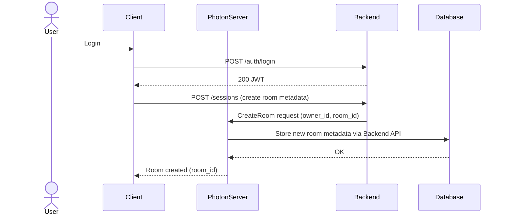

#### Join Sessione Esistente
Descrive la procedura con cui un visore si unisce a una stanza già creata nel server Photon.  
Il backend aggiorna la lista dei partecipanti sulla base delle notifiche di join ricevute.  
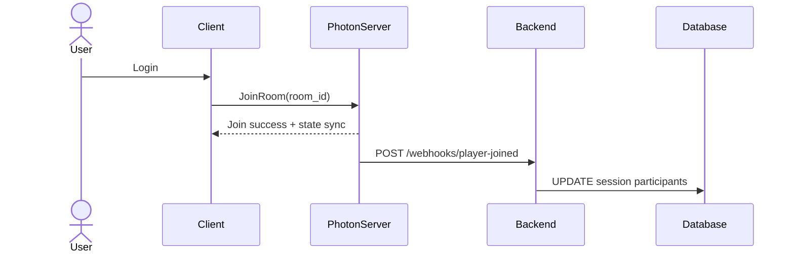

#### Autosave Periodico (Server-Side)
Il salvataggio automatico non è più avviato dai client ma direttamente dal server Photon.  
Il backend legge lo stato della room e salva periodicamente uno snapshot nel database.  
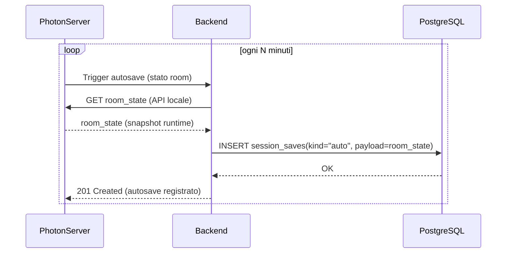

#### Salvataggio Manuale
Quando il server rileva una richiesta esplicita (es. via API di amministrazione), esegue un salvataggio manuale persistendo lo stato corrente della room.  
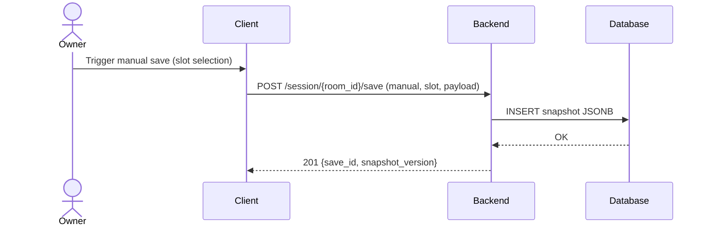

#### Chiusura Sessione
Alla chiusura della room, Photon invia un webhook al backend.  
Quest'ultimo esegue automaticamente un autosave finale nello slot dedicato e aggiorna lo stato della sessione a “closed”.  
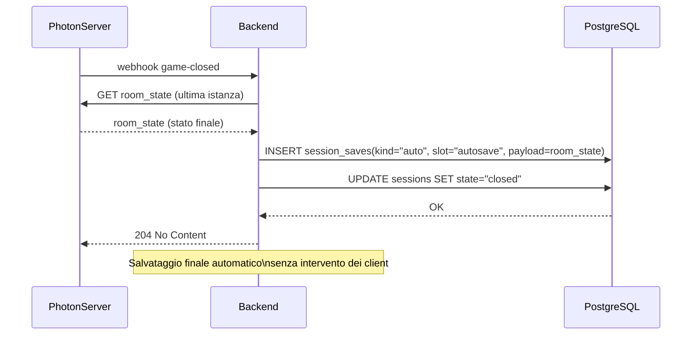

#### Setup e Risoluzione Ancore
Gestione del flusso di creazione e sincronizzazione delle ancore 3D tra i visori, tramite Meta Shared Spatial Anchors.  
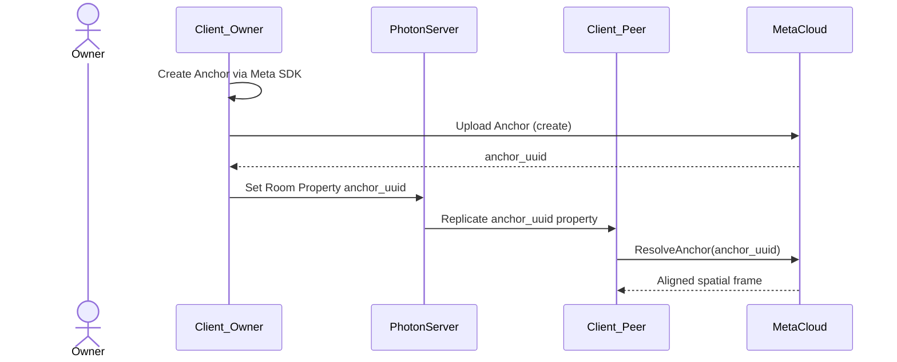

#### Recupero Snapshot
Descrive la riapertura di una sessione da uno snapshot precedentemente salvato, con caricamento completo dello stato.  
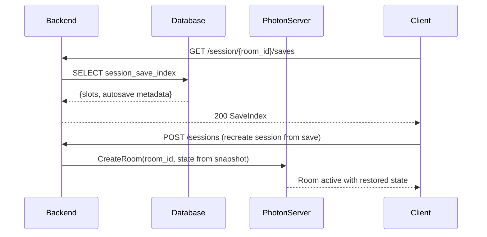
---

## Photon Host Mode

### Descrizione  
Questa configurazione rappresenta la prima versione esplorata del sistema, basata su Photon Fusion Host Mode.  
In questo modello, uno dei visori Meta Quest 3 assumeva il ruolo di host autorevole della stanza, gestendo direttamente lo stato runtime, mentre il backend FastAPI e il database PostgreSQL si occupavano di autenticazione e persistenza.

Nonostante offrisse una latenza estremamente bassa e un'infrastruttura minima, la soluzione è stata scartata per alcune limitazioni strutturali:  
- La  Room veniva chiusa automaticamente in caso di disconnessione dell'host  
- Non era presente alcun meccanismo di failover deterministico (chi diventasse il nuovo host)

Per questi motivi, pur avendo validato il principio di funzionamento multiutente, questa modalità non è stata considerata adatta per l'architettura finale.

---

## Conclusioni
Le analisi condotte avevano l'obiettivo di individuare un'architettura che rispondesse ai requisiti funzionali e prestazionali richiesti, garantendo al tempo stesso un alto grado di flessibilità nella distribuzione e nella manutenzione del sistema.  
Dallo studio delle diverse soluzioni è emersa come opzione principale la configurazione basata su Photon Shared Mode, che offre un buon equilibrio tra semplicità operativa, resilienza e costi di esercizio contenuti. Questa scelta consente di mantenere la gestione delle sessioni distribuita tra i visori, riducendo la complessità infrastrutturale e sfruttando appieno le potenzialità della rete locale.

In alternativa è stata definita anche una versione basata su Photon Server Mode, pensata per quei contesti in cui il cliente richieda che tutti i dati restino confinati all'interno dell'infrastruttura on premise. In questo caso la gestione centralizzata offre maggiore controllo e tracciabilità, ma a fronte di un incremento dei costi di installazione e manutenzione. La coesistenza delle due soluzioni permette quindi di adattare la scelta finale in base ai vincoli economici e alle policy di sicurezza del progetto.

Entrambe le architetture sono state progettate per essere containerizzate tramite Docker Compose, così da rendere il processo di deploy uniforme e ripetibile, sia in ambienti locali sia su cloud provider. È stata inoltre prevista la possibilità di collegamento tramite VPN, utile per garantire attività di manutenzione e aggiornamento remoto senza necessità di interventi fisici.

La configurazione in Host Mode, analizzata inizialmente come base di partenza, è stata mantenuta solo a fini di confronto tecnico. Pur offrendo una latenza minima e una struttura estremamente semplice, la sua dipendenza da un singolo visore come host e la mancanza di un meccanismo di failover affidabile ne limitano fortemente l'utilizzo in scenari reali.